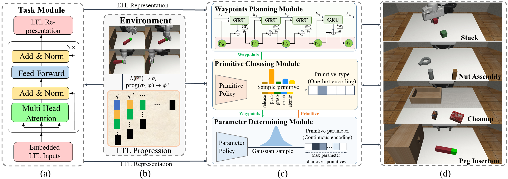

# HyTL
Exploiting Hybrid Policy in Reinforcement Learning for Interpretable Temporal Logic Manipulation
<p align="center">
    
</p>
If any questions, feel free to contact: zcharlie0257@gmail.com.

## Installation instructions
```
conda create -n hytl python=3.8
conda activate hytl

cd HyTL/

pip install -e .

conda install pytorch==1.12.1 torchvision==0.13.1 torchaudio==0.12.1 cudatoolkit=11.3 -c pytorch

cd robosuite/
pip install -e .
cd ..

pip install python-dateutil
pip install h5py
pip install gym==0.23.1
pip install gtimer
pip install sympy
conda install -c conda-forge spot
pip install torch_ac
pip install gymnasium
pip install ring
pip install dgl==1.1.2 -f https://data.dgl.ai/wheels/cu113/repo.html
pip install dglgo -f https://data.dgl.ai/wheels-test/repo.html
pip install numpy==1.23
pip install opencv-python
pip install scikit-video
pip install imageio[ffmpeg]
pip install imageio[pyav]
pip install matplotlib

pip install chardet
```

## Instructions for Reproducing Results
We recorded the following videos to visualize our simulation results for four long-horizon manipulations. The full training videos and evaluation videos are published in the [Dataset](https://drive.google.com/drive/folders/1IOUluLwOmxUgCeLtei34lt4dejfYuNeK).

### Example for Main results
#### Stack
```
cd scripts/
python train.py --env stack --LTL --waypoint --map_goal --path_max_len 6 --d_out 16 --way_weight 10.
```
#### Nut Assembly
```
cd scripts/
python train.py --env cleanup --LTL --waypoint --map_goal --path_max_len 6 --d_out 16 --way_weight 5
```
#### CleanUp
```
cd scripts/
python train.py --env stack --LTL --waypoint --map_goal --path_max_len 6 --d_out 16 --way_weight 10.
```
#### Peg Insertion
```
cd scripts/
python train.py --env peg_ins --LTL --waypoint --map_goal --path_max_len 4 --d_out 32
```

## Citation

```


```
